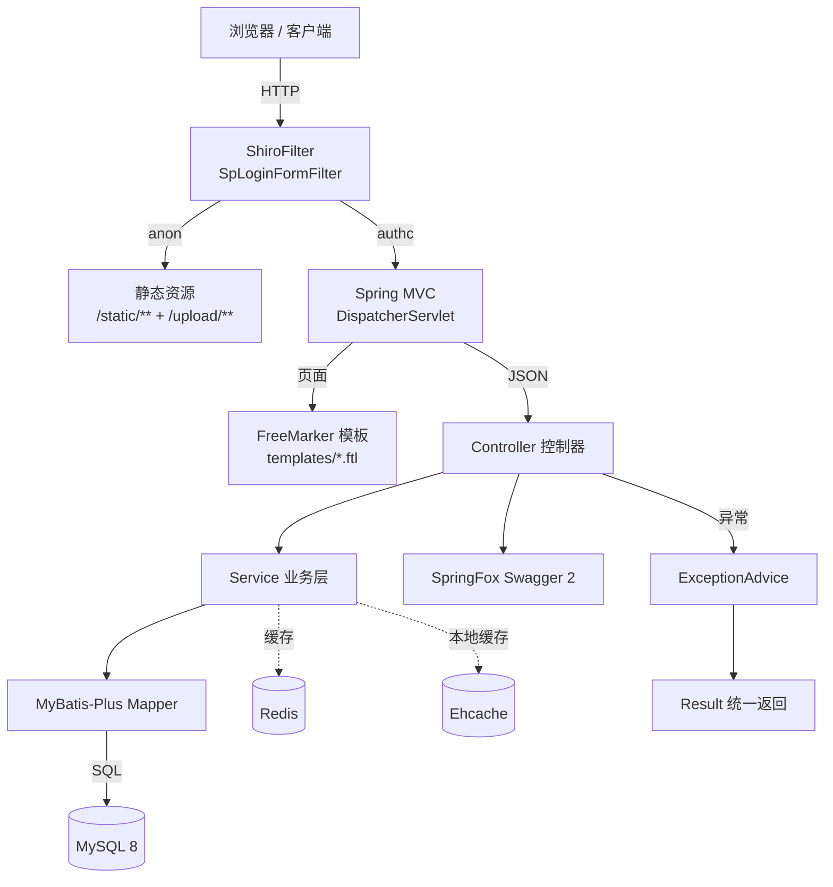
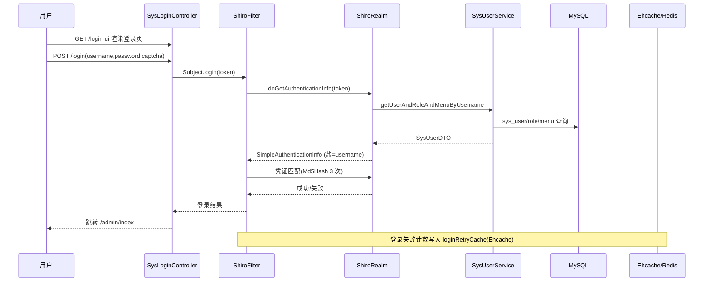

# 02 · 整体架构

## 2.1 架构总览



### 关键性质

- **前后端不分离**:Controller 既返回 `ModelAndView`(页面)又返回 `@ResponseBody Result<T>`(JSON)。
- **统一异常**:由 [ExceptionAdvice](file:///c:/Users/Zanna/.trae-cn/worktrees/MES-Springboot/feat-generate-code-wiki-6rEV1s/mes/src/main/java/com/wangziyang/mes/common/advice/ExceptionAdvice.java) 捕获,根据请求是否为 Ajax 决定返回 JSON 还是错误页。
- **统一结果**:所有 JSON 接口返回 [Result](file:///c:/Users/Zanna/.trae-cn/worktrees/MES-Springboot/feat-generate-code-wiki-6rEV1s/mes/src/main/java/com/wangziyang/mes/common/Result.java) 结构 `{code, data, msg}`。
- **统一实体基类**:[BaseEntity](file:///c:/Users/Zanna/.trae-cn/worktrees/MES-Springboot/feat-generate-code-wiki-6rEV1s/mes/src/main/java/com/wangziyang/mes/common/BaseEntity.java) 提供 `id / createTime / createUsername / updateTime / updateUsername`,由 [SpMetaObjectHandler](file:///c:/Users/Zanna/.trae-cn/worktrees/MES-Springboot/feat-generate-code-wiki-6rEV1s/mes/src/main/java/com/wangziyang/mes/common/config/SpMetaObjectHandler.java) 自动填充。
- **统一分页基类**:[BasePageReq](file:///c:/Users/Zanna/.trae-cn/worktrees/MES-Springboot/feat-generate-code-wiki-6rEV1s/mes/src/main/java/com/wangziyang/mes/common/BasePageReq.java) 继承 `Page`,默认按 `update_time` 排序。
- **统一认证**:[Shiro](file:///c:/Users/Zanna/.trae-cn/worktrees/MES-Springboot/feat-generate-code-wiki-6rEV1s/mes/src/main/java/com/wangziyang/mes/system/config/shiro/ShiroConfig.java) 负责登录、权限、会话。

## 2.2 技术分层

| 层 | 主要类/技术 | 职责 |
| --- | --- | --- |
| **视图层** | FreeMarker 模板 + Layui + ECharts + Three.js | 页面渲染、交互 |
| **控制层** | `@Controller` + `@RestController` | 路由、参数接收、视图/数据返回 |
| **业务层** | `IService` + `ServiceImpl` | 业务规则、事务管理 |
| **持久层** | MyBatis-Plus `BaseMapper` + XML | SQL 映射、动态 SQL |
| **数据层** | MySQL 8 + Druid 连接池 | 数据存储 |
| **安全层** | Shiro + JWT-风格 Token | 认证/授权 |
| **缓存层** | Redis(分布式)+ Ehcache(本地) | 二级缓存 |
| **横切层** | AOP、ExceptionAdvice、MetaObjectHandler、Swagger | 日志、异常、自动填充、API 文档 |

## 2.3 请求处理流程(典型分页查询)

以 `POST /admin/sys/user/page` 为例:

1. 浏览器发起 Ajax 请求 `POST /admin/sys/user/page`。
2. 请求先经 Shiro 过滤器链(`ShiroFilterFactoryBean` 配置在 [ShiroConfig](file:///c:/Users/Zanna/.trae-cn/worktrees/MES-Springboot/feat-generate-code-wiki-6rEV1s/mes/src/main/java/com/wangziyang/mes/system/config/shiro/ShiroConfig.java) 中),命中 `/**` → `authc`。
3. 由于是 Ajax,自定义的 [SpLoginFormFilter](file:///c:/Users/Zanna/.trae-cn/worktrees/MES-Springboot/feat-generate-code-wiki-6rEV1s/mes/src/main/java/com/wangziyang/mes/system/config/shiro/SpLoginFormFilter.java) 会在未登录时返回 JSON `{code:401}`。
4. 通过 Shiro 后由 Spring MVC 分发到 [SysUserController#page](file:///c:/Users/Zanna/.trae-cn/worktrees/MES-Springboot/feat-generate-code-wiki-6rEV1s/mes/src/main/java/com/wangziyang/mes/system/controller/admin/SysUserController.java#L70-L95)。
5. 控制器构造 `QueryWrapper`,调用 `ISysUserService.page(req, qw)`。
6. MyBatis-Plus 分页拦截器([PaginationInterceptor](file:///c:/Users/Zanna/.trae-cn/worktrees/MES-Springboot/feat-generate-code-wiki-6rEV1s/mes/src/main/java/com/wangziyang/mes/common/config/MybatisPlusConfig.java)) 解析 `Page`,执行 count SQL + list SQL。
7. 控制器再为每条记录设置 `deptName`,返回 `Result.success(page)`。
8. 全局异常由 [ExceptionAdvice](file:///c:/Users/Zanna/.trae-cn/worktrees/MES-Springboot/feat-generate-code-wiki-6rEV1s/mes/src/main/java/com/wangziyang/mes/common/advice/ExceptionAdvice.java) 兜底。
9. 前端使用 Layui `table.render` 渲染。

## 2.4 登录与会话流程



关键点:

- 凭证匹配算法在 [RetryLimitCredentialsMatcher](file:///c:/Users/Zanna/.trae-cn/worktrees/MES-Springboot/feat-generate-code-wiki-6rEV1s/mes/src/main/java/com/wangziyang/mes/system/config/shiro/RetryLimitCredentialsMatcher.java) 中配置,使用 `md5` + 3 次 hash + 盐(`username`)。
- 登录失败次数通过 Ehcache 缓存 `loginRetryCache`,实现 10 分钟内的失败锁定。
- 会话存储在 [ShiroConfig](file:///c:/Users/Zanna/.trae-cn/worktrees/MES-Springboot/feat-generate-code-wiki-6rEV1s/mes/src/main/java/com/wangziyang/mes/system/config/shiro/ShiroConfig.java) 的 `sessionManager()` 中,默认走 `MemorySessionDAO`,可通过 `cacheType=redis` 切换到 Redis SessionDAO。
- 客户端入口:[SysLoginController#client](file:///c:/Users/Zanna/.trae-cn/worktrees/MES-Springboot/feat-generate-code-wiki-6rEV1s/mes/src/main/java/com/wangziyang/mes/system/controller/client/SysLoginController.java)。

## 2.5 启动流程

1. JVM 启动 → 加载 [SparchetypeApplication](file:///c:/Users/Zanna/.trae-cn/worktrees/MES-Springboot/feat-generate-code-wiki-6rEV1s/mes/src/main/java/com/wangziyang/mes/SparchetypeApplication.java) 的 `main`。
2. Spring Boot 扫描 `com.wangziyang.mes` 包。
3. 加载 `application.yml`,激活 `pro` profile(默认)。
4. 加载 [MybatisPlusConfig](file:///c:/Users/Zanna/.trae-cn/worktrees/MES-Springboot/feat-generate-code-wiki-6rEV1s/mes/src/main/java/com/wangziyang/mes/common/config/MybatisPlusConfig.java)(分页拦截器 + MapperScan)。
5. 加载 [ShiroConfig](file:///c:/Users/Zanna/.trae-cn/worktrees/MES-Springboot/feat-generate-code-wiki-6rEV1s/mes/src/main/java/com/wangziyang/mes/system/config/shiro/ShiroConfig.java)(Realm、SecurityManager、Filter)。
6. 加载 [SwaggerConfig](file:///c:/Users/Zanna/.trae-cn/worktrees/MES-Springboot/feat-generate-code-wiki-6rEV1s/mes/src/main/java/com/wangziyang/mes/system/config/swagger/SwaggerConfig.java)(API 文档)。
7. 加载 [WebMvcConfig](file:///c:/Users/Zanna/.trae-cn/worktrees/MES-Springboot/feat-generate-code-wiki-6rEV1s/mes/src/main/java/com/wangziyang/mes/common/config/WebMvcConfig.java)(上传文件 / 头像静态资源映射)。
8. 启动内置 Tomcat,默认 8080 端口。

## 2.6 关键依赖版本

来源:[mes/pom.xml](file:///c:/Users/Zanna/.trae-cn/worktrees/MES-Springboot/feat-generate-code-wiki-6rEV1s/mes/pom.xml)

| 依赖 | 版本 | 说明 |
| ---- | ---- | ---- |
| spring-boot-starter-parent | 2.1.7.RELEASE | Spring Boot 父 POM |
| mybatis-plus-boot-starter | 3.1.2 | ORM |
| mybatis-plus-generator | 3.2.0 | 代码生成器 |
| druid-spring-boot-starter | 1.1.9 | 数据源 |
| mysql-connector-java | (Spring Boot 管理) | MySQL 驱动 |
| mybatis-typehandlers-jsr310 | 1.0.1 | JSR-310 时间类型支持 |
| spring-boot-starter-freemarker | (Spring Boot 管理) | 模板引擎 |
| shiro-web / shiro-spring / shiro-ehcache | 1.4.0 | 安全 |
| shiro-freemarker-tags(mingsoft) | 1.0.1 | FreeMarker 中使用 Shiro 标签 |
| spring-boot-starter-cache | (Spring Boot 管理) | 缓存抽象 |
| ehcache | (Spring Boot 管理) | 本地缓存 |
| spring-boot-starter-data-redis | (Spring Boot 管理) | Redis |
| jedis | 2.9.0 | Redis 客户端 |
| commons-lang3 | 3.6 | 通用工具 |
| logstash-logback-encoder | 5.3 | Logstash 日志 |
| springfox-swagger2 / springfox-swagger-ui | 2.9.2 | API 文档 |
| hutool-all | 5.1.5 | 工具集 |
| poi-ooxml | 4.1.2 | Excel |

## 2.7 配置项

主配置:[application.yml](file:///c:/Users/Zanna/.trae-cn/worktrees/MES-Springboot/feat-generate-code-wiki-6rEV1s/mes/src/main/resources/application.yml)

```yaml
server:
  session-timeout: 1800
spring:
  profiles:
    active: pro
  cache:
    type: ehcache
    ehcache:
      config: classpath:config/ehcache.xml
swagger:
  controller: com.wangziyang.mes
  description: MES接口管理
  enable: true
  license: wangziyang
  licenseUrl: https://gitee.com/wangziyangyang/MES-Sprongboot
  title: 王子杨的API 管理
  version: 1.0.0
```

环境配置:[application-pro.yml](file:///c:/Users/Zanna/.trae-cn/worktrees/MES-Springboot/feat-generate-code-wiki-6rEV1s/mes/src/main/resources/application-pro.yml)

主要项:

- `spring.mvc.view`:`/templates/` 前缀 + `.ftl` 后缀
- `spring.freemarker`:UTF-8、关闭缓存(开发期)、`classic_compatible=true`
- `spring.datasource`:Druid + MySQL 8(`jdbc:mysql://localhost:3306/sparchetype`)
- `spring.redis`:`127.0.0.1:6379`,无密码
- `server.session-timeout`:1800 秒

> 提示:`ehcache.xml` 配置路径在 `application.yml` 中为 `classpath:config/ehcache.xml`,但实际文件位于 `classpath:ehcache.xml`,详见 [08-deployment.md](08-deployment.md) 注意事项。

## 2.8 与外部系统的对接

- **ELK / Logstash**:日志通过 `logstash-logback-encoder` 推送到 `192.168.137.95:5601`(logback.xml 中默认目标地址)。
- **Druid 监控**:`/druid/*` 放行,可查看 SQL 执行情况与连接池。
- **Swagger**:`/swagger-ui.html`。
- **数字孪生**:浏览器端使用 `static/lib/ThreeJs/*` + `static/js/mes/digitization/*`。

## 2.9 下一步

- 模块级职责一览 → [03-modules.md](03-modules.md)
- 公共类与工具详解 → [04-common.md](04-common.md)
- 系统管理 / Shiro / 权限 → [05-system.md](05-system.md)
