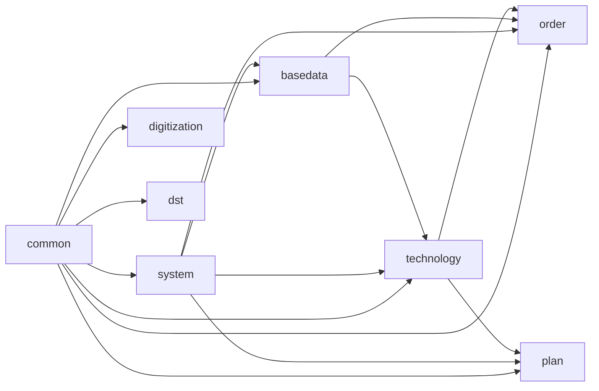

# 03 · 模块划分与依赖

> 全部 Java 包以 `com.wangziyang.mes` 为根。模块之间没有显式的 Maven module 隔离(整个项目只有一个 `mes/pom.xml`),而是通过**包结构**进行逻辑隔离。

## 3.1 包结构总览

```text
com.wangziyang.mes
├── SparchetypeApplication.java        // Spring Boot 启动入口
├── package-info.java
├── common/                            // 通用基础组件
│   ├── BaseController.java
│   ├── BaseEntity.java
│   ├── BasePageReq.java
│   ├── Result.java
│   ├── advice/                        // 全局异常 / 错误视图
│   │   ├── ExceptionAdvice.java
│   │   └── MyErrorViewResolver.java
│   ├── config/                        // 通用配置
│   │   ├── JsonConfig.java
│   │   ├── MybatisPlusConfig.java
│   │   ├── ShiroTagsFreeMarkerConfig.java
│   │   ├── SpMetaObjectHandler.java
│   │   └── WebMvcConfig.java
│   ├── enums/
│   │   └── CommonEnum.java
│   └── util/                          // 静态工具
│       ├── ByteUtil.java
│       ├── CodeGenerator.java
│       ├── HashUtil.java
│       ├── HttpUtil.java
│       ├── IdUtil.java
│       ├── RandomVerificationCodeUtil.java
│       └── TreeUtil.java
├── system/                            // 系统管理(用户/角色/权限/Shiro/Swagger)
│   ├── config/
│   │   ├── shiro/                     // Shiro 完整配置
│   │   └── swagger/                   // Swagger 配置
│   ├── controller/                    // admin / client / file 三类
│   ├── dto/                           // 业务 DTO
│   ├── entity/                        // 数据库实体
│   ├── enums/                         // 系统模块枚举
│   ├── mapper/                        // MyBatis-Plus Mapper
│   ├── request/                       // 页面请求参数
│   ├── service/                       // 业务接口 + impl
│   └── vo/                            // 视图对象
├── basedata/                          // 基础数据(物料/动态表/字典)
│   ├── common/                        // 与 system 字典配套的扩展
│   ├── controller/
│   ├── dto/
│   ├── entity/
│   ├── mapper/
│   ├── request/
│   └── service/
├── technology/                        // 工艺管理
│   ├── controller/                    // SpBom/SpFlow/SpOper/SpPart/...
│   ├── dto/
│   ├── entity/
│   ├── mapper/
│   ├── request/
│   ├── service/
│   └── vo/
├── order/                             // 订单/工单
├── plan/                              // 物料需求计划
├── digitization/                      // 数字化平台(数据大屏)
└── dst/                               // Digital Simulation Twin(数字孪生 3D)
```

## 3.2 模块依赖关系



> 说明:以上依赖关系为**编译期/调用期**的逻辑依赖,代表一个模块的 Service/Controller 会调用其他模块的实体或服务。例如:
> - 任意业务 Controller 通常都继承 `com.wangziyang.mes.common.BaseController`。
> - 业务表的审计字段由 `common.config.SpMetaObjectHandler` 统一填充。
> - `system.config.shiro.ShiroConfig` 中 `ShiroRealm` 调用 `ISysUserService`,所以 `system` 是认证中心。

## 3.3 各模块职责

| 模块 | 包路径 | 职责 | 关键类/文件 |
| ---- | ---- | ---- | ---- |
| **启动入口** | `com.wangziyang.mes` | Spring Boot 启动 | [SparchetypeApplication.java](file:///c:/Users/Zanna/.trae-cn/worktrees/MES-Springboot/feat-generate-code-wiki-6rEV1s/mes/src/main/java/com/wangziyang/mes/SparchetypeApplication.java) |
| **common** | `com.wangziyang.mes.common` | 公共基类、结果、异常、工具、配置 | [BaseController](file:///c:/Users/Zanna/.trae-cn/worktrees/MES-Springboot/feat-generate-code-wiki-6rEV1s/mes/src/main/java/com/wangziyang/mes/common/BaseController.java)、[BaseEntity](file:///c:/Users/Zanna/.trae-cn/worktrees/MES-Springboot/feat-generate-code-wiki-6rEV1s/mes/src/main/java/com/wangziyang/mes/common/BaseEntity.java)、[BasePageReq](file:///c:/Users/Zanna/.trae-cn/worktrees/MES-Springboot/feat-generate-code-wiki-6rEV1s/mes/src/main/java/com/wangziyang/mes/common/BasePageReq.java)、[Result](file:///c:/Users/Zanna/.trae-cn/worktrees/MES-Springboot/feat-generate-code-wiki-6rEV1s/mes/src/main/java/com/wangziyang/mes/common/Result.java)、[ExceptionAdvice](file:///c:/Users/Zanna/.trae-cn/worktrees/MES-Springboot/feat-generate-code-wiki-6rEV1s/mes/src/main/java/com/wangziyang/mes/common/advice/ExceptionAdvice.java)、[MybatisPlusConfig](file:///c:/Users/Zanna/.trae-cn/worktrees/MES-Springboot/feat-generate-code-wiki-6rEV1s/mes/src/main/java/com/wangziyang/mes/common/config/MybatisPlusConfig.java)、[SpMetaObjectHandler](file:///c:/Users/Zanna/.trae-cn/worktrees/MES-Springboot/feat-generate-code-wiki-6rEV1s/mes/src/main/java/com/wangziyang/mes/common/config/SpMetaObjectHandler.java)、[WebMvcConfig](file:///c:/Users/Zanna/.trae-cn/worktrees/MES-Springboot/feat-generate-code-wiki-6rEV1s/mes/src/main/java/com/wangziyang/mes/common/config/WebMvcConfig.java) |
| **system** | `com.wangziyang.mes.system` | 用户/角色/菜单/部门/字典等基础数据;Shiro 安全;Swagger | 详见 [05-system.md](05-system.md) |
| **basedata** | `com.wangziyang.mes.basedata` | 物料主数据、动态表管理、动态字典、查询表字段 | 详见 [07-business.md](07-business.md) |
| **technology** | `com.wangziyang.mes.technology` | 工艺路线、BOM、零件、工序、工序内容、工序-物料清单等 | 详见 [06-technology.md](06-technology.md) |
| **order** | `com.wangziyang.mes.order` | 生产工单(下达成品) | 详见 [07-business.md](07-business.md) |
| **plan** | `com.wangziyang.mes.plan` | 物料需求计划 | 详见 [07-business.md](07-business.md) |
| **digitization** | `com.wangziyang.mes.digitization` | 数字化平台(数据大屏入口) | 详见 [07-business.md](07-business.md) |
| **dst** | `com.wangziyang.mes.dst` | 数字孪生 3D 仿真(基于 Three.js) | 详见 [07-business.md](07-business.md) |

## 3.4 模块命名规范

- 实体类:**单数 PascalCase**,数据库表名通过 MyBatis-Plus `@TableName` 指定(如 `@TableName("sp_bom")`),多数带 `sp_` 前缀。
- Service 接口:`IXxxService`,实现类:`XxxServiceImpl extends ServiceImpl<Mapper, Entity> implements IXxxService`。
- Controller:`XxxController`,`@RequestMapping` 一般对应到 FreeMarker 模板目录的子路径。
- 页面请求参数:`XxxReq` / `XxxPageReq`,**每个表一张表一个请求参数对象**。
- 视图对象:`XxxVO` / `XxxDto`,通过 MyBatis-Plus `@TableField(exist = false)` 标记非持久化字段。

## 3.5 静态资源与模板

| 资源类型 | 路径 |
| -------- | ---- |
| FreeMarker 页面模板 | `mes/src/main/resources/templates/**/*.ftl` |
| CSS | `mes/src/main/resources/static/css/*` |
| JS | `mes/src/main/resources/static/js/**` |
| 图片 | `mes/src/main/resources/static/image/*` |
| 字体 | `mes/src/main/resources/static/font/*` |
| Layui 模块扩展 | `mes/src/main/resources/static/js/layuimodule/sp/*` |
| 图表库 | `mes/src/main/resources/static/lib/echarts/*`、`static/lib/dayjs.min.js` |
| 数字孪生 3D 资源 | `mes/src/main/resources/static/lib/ThreeJs/*` |
| Druid 监控 | `mes/src/main/resources/static/json/*` |
| 上传目录(运行时) | `${user.dir}/upload/` |

模板目录映射:

- `templates/login.ftl` → 登录页
- `templates/admin/index.ftl` → 后台主页
- `templates/admin/system/**` → 系统管理
- `templates/basedata/**` → 基础数据
- `templates/technology/**` → 工艺管理
- `templates/order/production/**` → 工单
- `templates/plan/materialdemand/**` → 物料需求计划
- `templates/digitization/**` → 数字化平台
- `templates/error/**` → 错误页(403/404/500)
- `templates/codegenerator/*` → 代码生成器前端模板(供 [CodeGenerator](file:///c:/Users/Zanna/.trae-cn/worktrees/MES-Springboot/feat-generate-code-wiki-6rEV1s/mes/src/main/java/com/wangziyang/mes/common/util/CodeGenerator.java) 使用)

## 3.6 模块间的数据流转举例

| 场景 | 流转 |
| ---- | ---- |
| 新建 BOM | Controller → `ISpBomService` 写 `sp_bom` + `ISpBomItemService` 写 `sp_bom_item`,期间通过 `SpMetaObjectHandler` 自动写入 `createUsername / createTime` |
| 工艺路线查询 | Controller 加载 `sp_flow`,通过关联表 `sp_flow_oper_relation` 找到工序,再到 `sp_oper` / `sp_oper_content` / `sp_oper_material_list` / `sp_oper_equipment` / `sp_oper_tech_doc` |
| 数字孪生 | `/digital/simulation/list-ui` → 渲染 `templates/digitization/3DProject.ftl` → 浏览器加载 `static/lib/ThreeJs/Modules.js` 等前端资源 |
| 数字化平台 | `/digitization/plan-data/list-ui` → 渲染 `templates/digitization/planDemo.ftl` → ECharts 通过 Ajax 拉取数据 |
| 动态表管理 | `SpTableManagerController` 维护 `sp_table_manager` + `sp_table_manager_item`,结合 `TableNameDataController` 反射出任意表的分页/CRUD 能力 |

## 3.7 下一步

- 公共类与工具详解 → [04-common.md](04-common.md)
- 系统管理 / Shiro / Swagger → [05-system.md](05-system.md)
- 工艺管理 / BOM / 工艺路线 → [06-technology.md](06-technology.md)
- 基础数据 / 订单 / 计划 / 数字化 → [07-business.md](07-business.md)
