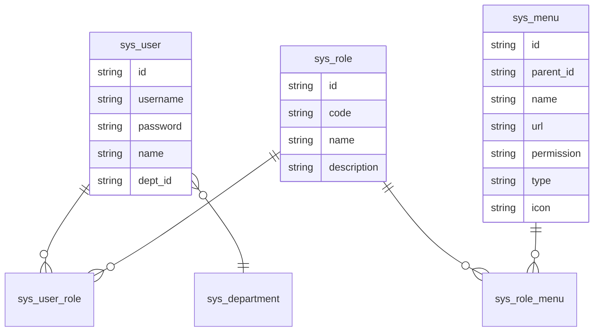

# 05 · 系统管理 system

> 位置:`com.wangziyang.mes.system`
> 角色:**系统基础数据 + 安全框架**。包含 Shiro/Swagger 配置、用户/角色/菜单/部门/字典/权限/文件上传等基础能力。

## 5.1 目录结构

```text
com.wangziyang.mes.system
├── config/
│   ├── shiro/
│   │   ├── RedisCache.java
│   │   ├── RedisCacheManager.java
│   │   ├── RedisManager.java
│   │   ├── RedisSessionDAO.java
│   │   ├── RetryLimitCredentialsMatcher.java
│   │   ├── SerializeUtils.java
│   │   ├── ShiroConfig.java
│   │   ├── ShiroRealm.java
│   │   ├── SpLoginFormFilter.java
│   │   ├── SpSessionListener.java
│   │   └── SpUsernamePasswordToken.java
│   ├── swagger/
│   │   └── SwaggerConfig.java
│   └── package-info.java
├── controller/
│   ├── admin/         // 后台管理
│   │   ├── SysDepartmentController.java
│   │   ├── SysDictController.java
│   │   ├── SysLoginController.java
│   │   ├── SysMenuController.java
│   │   ├── SysPermissionController.java
│   │   ├── SysRoleController.java
│   │   ├── SysToolController.java
│   │   └── SysUserController.java
│   ├── client/        // 客户端入口
│   │   └── SysLoginController.java
│   └── file/
│       └── FileController.java
├── dto/               // 业务 DTO(SysUserDTO/SysRoleDTO/SysMenuDTO/SysDictDTO)
├── entity/            // 实体(SysUser/SysRole/SysMenu/SysDepartment/SysDict/SysRoleMenu/SysUserRole)
├── enums/             // 业务枚举(SysUserEnum/SysRoleEnum/SysMenuEnum)
├── mapper/            // MyBatis-Plus Mapper
├── request/           // 页面请求参数(SysUserPageReq 等)
├── service/           // IService + impl
└── vo/                // TreeVO 等视图对象
```

## 5.2 Shiro 安全体系

### 5.2.1 [ShiroConfig](file:///c:/Users/Zanna/.trae-cn/worktrees/MES-Springboot/feat-generate-code-wiki-6rEV1s/mes/src/main/java/com/wangziyang/mes/system/config/shiro/ShiroConfig.java)

核心 Bean 与过滤器链配置。

**核心 Bean**:

| Bean | 类型 | 作用 |
| ---- | ---- | ---- |
| `RetryLimitCredentialsMatcher` | `HashedCredentialsMatcher` | 凭证匹配 + 失败次数限制;算法 `md5`,3 次迭代,默认 5 次失败锁定 |
| `ShiroRealm` | `AuthorizingRealm` | 认证 + 授权 |
| `ehCacheManager` | `EhCacheManager` | 本地缓存(默认) |
| `rediscacheManager` / `redisManager` / `RedisSessionDAO` | 自定义 | `cacheType=redis` 时启用 |
| `sessionManager` | `DefaultWebSessionManager` | Session 管理,带 `SpSessionListener` |
| `securityManager` | `DefaultWebSecurityManager` | 装配 Realm/CacheManager/SessionManager |
| `shiroFilterFactoryBean` | `ShiroFilterFactoryBean` | 过滤器链 |
| `authorizationAttributeSourceAdvisor` | AOP Advisor | 启用 `@RequiresPermissions` |

**过滤器链(摘录)**:

| 路径 | 过滤器 | 说明 |
| ---- | ------ | ---- |
| `/login`、`/verification/code`、`/register/**` | `anon` | 登录、验证码、注册 |
| `/css/**`、`/image/**`、`/js/**`、`/json/**`、`/lib/**`、`/fonts/**`、`/docs/**` | `anon` | 静态资源 |
| `/druid/**`、`/upload/**`、`/files/**`、`/admin/sys/user/avatar/**`、`/admin/sys/user/upload-avatar` | `anon` | 监控、上传、头像 |
| `/client/**`、`/blog`、`/blog/open/**` | `anon` | 客户端入口 |
| `/logout` | `logout` | 登出 |
| `/`、`/**` | `authc`(自定义 `SpLoginFormFilter`) | 默认需登录 |

### 5.2.2 [ShiroRealm](file:///c:/Users/Zanna/.trae-cn/worktrees/MES-Springboot/feat-generate-code-wiki-6rEV1s/mes/src/main/java/com/wangziyang/mes/system/config/shiro/ShiroRealm.java)

- `doGetAuthenticationInfo`:
  1. 根据 username 调 `ISysUserService.getUserAndRoleAndMenuByUsername` 取 `SysUserDTO`。
  2. 用户不存在 → 抛 `UnknownAccountException`。
  3. 用户被禁用/删除(`deleted != 0`)→ 抛 `LockedAccountException`。
  4. 以 `username` 作为盐,返回 `SimpleAuthenticationInfo(username, password, byteSource, realmName)`。
- `doGetAuthorizationInfo`:
  1. 根据 username 取 `SysUserDTO`。
  2. 遍历角色-菜单的 `permission` 字段(逗号分隔),加入 `perms` 集合。
  3. 返回 `SimpleAuthorizationInfo`。

### 5.2.3 [SpLoginFormFilter](file:///c:/Users/Zanna/.trae-cn/worktrees/MES-Springboot/feat-generate-code-wiki-6rEV1s/mes/src/main/java/com/wangziyang/mes/system/config/shiro/SpLoginFormFilter.java)

继承 `FormAuthenticationFilter`,重写 `onAccessDenied`:

- 登录请求 → 交给 `executeLogin`。
- 非登录请求:
  - Ajax 请求 → `setStatus(401)`,不跳转(由前端根据 401 跳登录页)。
  - 普通请求 → `saveRequestAndRedirectToLogin`。

### 5.2.4 [RetryLimitCredentialsMatcher](file:///c:/Users/Zanna/.trae-cn/worktrees/MES-Springboot/feat-generate-code-wiki-6rEV1s/mes/src/main/java/com/wangziyang/mes/system/config/shiro/RetryLimitCredentialsMatcher.java)

- 通过 Ehcache 缓存 `loginRetryCache` 记录每个 username 的失败次数。
- 默认上限 5 次,超过抛 `ExcessiveAttemptsException`(由 ShiroRealm 异常处理链兜底)。
- 成功登录 → 清零。

### 5.2.5 Redis 缓存与会话

| 类 | 作用 |
| -- | ---- |
| [RedisManager](file:///c:/Users/Zanna/.trae-cn/worktrees/MES-Springboot/feat-generate-code-wiki-6rEV1s/mes/src/main/java/com/wangziyang/mes/system/config/shiro/RedisManager.java) | Jedis 封装 |
| [RedisCache / RedisCacheManager](file:///c:/Users/Zanna/.trae-cn/worktrees/MES-Springboot/feat-generate-code-wiki-6rEV1s/mes/src/main/java/com/wangziyang/mes/system/config/shiro/RedisCache.java) | 实现 Shiro `Cache` / `CacheManager`,基于 Redis |
| [RedisSessionDAO](file:///c:/Users/Zanna/.trae-cn/worktrees/MES-Springboot/feat-generate-code-wiki-6rEV1s/mes/src/main/java/com/wangziyang/mes/system/config/shiro/RedisSessionDAO.java) | Session 持久化到 Redis |
| [SerializeUtils](file:///c:/Users/Zanna/.trae-cn/worktrees/MES-Springboot/feat-generate-code-wiki-6rEV1s/mes/src/main/java/com/wangziyang/mes/system/config/shiro/SerializeUtils.java) | JDK 序列化/反序列化 |
| [SpSessionListener](file:///c:/Users/Zanna/.trae-cn/worktrees/MES-Springboot/feat-generate-code-wiki-6rEV1s/mes/src/main/java/com/wangziyang/mes/system/config/shiro/SpSessionListener.java) | 维护在线人数 |
| [SpUsernamePasswordToken](file:///c:/Users/Zanna/.trae-cn/worktrees/MES-Springboot/feat-generate-code-wiki-6rEV1s/mes/src/main/java/com/wangziyang/mes/system/config/shiro/SpUsernamePasswordToken.java) | 自定义 token(支持 captcha) |

## 5.3 Swagger

[SwaggerConfig](file:///c:/Users/Zanna/.trae-cn/worktrees/MES-Springboot/feat-generate-code-wiki-6rEV1s/mes/src/main/java/com/wangziyang/mes/system/config/swagger/SwaggerConfig.java) 通过 `@ConfigurationProperties(prefix="swagger")` 加载配置:

```yaml
swagger:
  enable: true
  controller: com.wangziyang.mes
  title: 王子杨的API 管理
  description: MES接口管理
  version: 1.0.0
  license: wangziyang
  licenseUrl: https://gitee.com/wangziyangyang/MES-Sprongboot
```

启动后访问 `http://localhost:8080/swagger-ui.html`。

## 5.4 实体与表

| 实体 | 表名 | 说明 |
| ---- | ---- | ---- |
| `SysUser` | `sp_sys_user` | 用户;含 name/username/password/deptId/email/mobile/sex/birthday/picId/... |
| `SysRole` | `sp_sys_role` | 角色;含 code/name/description |
| `SysMenu` | `sp_sys_menu` | 菜单;含 parentId/type(目录/菜单/按钮)/permission/url/icon |
| `SysRoleMenu` | `sp_sys_role_menu` | 角色-菜单关联 |
| `SysUserRole` | `sp_sys_user_role` | 用户-角色关联 |
| `SysDepartment` | `sp_sys_department` | 组织/部门 |
| `SysDict` | `sp_sys_dict` | 字典(类别+字典项) |

`SysUser` 状态字段(参见 [SysUserEnum](file:///c:/Users/Zanna/.trae-cn/worktrees/MES-Springboot/feat-generate-code-wiki-6rEV1s/mes/src/main/java/com/wangziyang/mes/system/enums/SysUserEnum.java)):

- `0` 正常
- `1` 已删除
- `2` 已禁用

## 5.5 关键 Controller

### 5.5.1 后台登录与首页

[SysLoginController(admin)](file:///c:/Users/Zanna/.trae-cn/worktrees/MES-Springboot/feat-generate-code-wiki-6rEV1s/mes/src/main/java/com/wangziyang/mes/system/controller/admin/SysLoginController.java):

| 接口 | 说明 |
| ---- | ---- |
| `GET /admin`、`/admin/index` | 后台首页模板 |
| `GET /admin/welcome-ui` | 欢迎页 |
| `GET /admin/list/index/menu/tree` | 返回当前用户的菜单树(admin 看全部,其他用户按角色过滤) |
| `GET /admin/list/index/menu/search/tree/{menuName}` | 按名称过滤的菜单树 |
| `GET /admin/login-ui`、`POST /login`、`GET /logout` | 登录页 / 登录 / 登出 |
| `GET /verification/code` | 图形验证码(图片流) |

### 5.5.2 用户管理

[SysUserController](file:///c:/Users/Zanna/.trae-cn/worktrees/MES-Springboot/feat-generate-code-wiki-6rEV1s/mes/src/main/java/com/wangziyang/mes/system/controller/admin/SysUserController.java):

- `GET /admin/sys/user/list-ui` → 渲染列表页
- `POST /admin/sys/user/page` → 分页查询
- `GET /admin/sys/user/add-or-update-ui` → 新增/编辑页
- `POST /admin/sys/user/save` / `/update`
- `POST /admin/sys/user/delete`
- `GET /admin/sys/user/info` → 当前用户信息
- `POST /admin/sys/user/change-password` → 修改密码
- `POST /admin/sys/user/upload-avatar` → 上传头像
- `GET /admin/sys/user/all` → 不分页列出所有用户

`SysUserServiceImpl.save()` 中对密码做 `new Md5Hash(password, username, 3)` 加密;`update()` 时如果密码已为 32 位十六进制则不再加密。

### 5.5.3 角色管理

[SysRoleController](file:///c:/Users/Zanna/.trae-cn/worktrees/MES-Springboot/feat-generate-code-wiki-6rEV1s/mes/src/main/java/com/wangziyang/mes/system/controller/admin/SysRoleController.java):

- 分页、CRUD
- 角色授权菜单

### 5.5.4 菜单管理

[SysMenuController](file:///c:/Users/Zanna/.trae-cn/worktrees/MES-Springboot/feat-generate-code-wiki-6rEV1s/mes/src/main/java/com/wangziyang/mes/system/controller/admin/SysMenuController.java):

- 菜单树 CRUD
- 树形结构由 [TreeUtil](file:///c:/Users/Zanna/.trae-cn/worktrees/MES-Springboot/feat-generate-code-wiki-6rEV1s/mes/src/main/java/com/wangziyang/mes/common/util/TreeUtil.java) 构建

### 5.5.5 部门 / 字典 / 权限

- [SysDepartmentController](file:///c:/Users/Zanna/.trae-cn/worktrees/MES-Springboot/feat-generate-code-wiki-6rEV1s/mes/src/main/java/com/wangziyang/mes/system/controller/admin/SysDepartmentController.java):部门树 CRUD
- [SysDictController](file:///c:/Users/Zanna/.trae-cn/worktrees/MES-Springboot/feat-generate-code-wiki-6rEV1s/mes/src/main/java/com/wangziyang/mes/system/controller/admin/SysDictController.java):字典维护
- [SysPermissionController](file:///c:/Users/Zanna/.trae-cn/worktrees/MES-Springboot/feat-generate-code-wiki-6rEV1s/mes/src/main/java/com/wangziyang/mes/system/controller/admin/SysPermissionController.java):权限分配(用户-角色、角色-菜单)

### 5.5.6 工具页

[SysToolController](file:///c:/Users/Zanna/.trae-cn/worktrees/MES-Springboot/feat-generate-code-wiki-6rEV1s/mes/src/main/java/com/wangziyang/mes/system/controller/admin/SysToolController.java) 提供:图标选择、颜色选择、富文本编辑器、表单步骤页等演示页。

### 5.5.7 客户端登录

[SysLoginController(client)](file:///c:/Users/Zanna/.trae-cn/worktrees/MES-Springboot/feat-generate-code-wiki-6rEV1s/mes/src/main/java/com/wangziyang/mes/system/controller/client/SysLoginController.java) 提供 `/client/**` 的独立入口(在 Shiro 中已放行)。

### 5.5.8 文件上传

[FileController](file:///c:/Users/Zanna/.trae-cn/worktrees/MES-Springboot/feat-generate-code-wiki-6rEV1s/mes/src/main/java/com/wangziyang/mes/system/controller/file/FileController.java) 提供通用文件上传/下载接口。

## 5.6 关键 Service / DTO

### 5.6.1 [ISysUserService](file:///c:/Users/Zanna/.trae-cn/worktrees/MES-Springboot/feat-generate-code-wiki-6rEV1s/mes/src/main/java/com/wangziyang/mes/system/service/ISysUserService.java)

```java
SysUserDTO getUserAndRoleAndMenuByUsername(String username) throws Exception;
void save(SysUserDTO record) throws Exception;     // 含密码加密、角色重建
void update(SysUserDTO record) throws Exception;
```

### 5.6.2 DTO

| DTO | 包含字段 |
| --- | -------- |
| [SysUserDTO](file:///c:/Users/Zanna/.trae-cn/worktrees/MES-Springboot/feat-generate-code-wiki-6rEV1s/mes/src/main/java/com/wangziyang/mes/system/dto/SysUserDTO.java) | 继承 `SysUser` + `List<SysRoleDTO> sysRoleDTOs` |
| [SysRoleDTO](file:///c:/Users/Zanna/.trae-cn/worktrees/MES-Springboot/feat-generate-code-wiki-6rEV1s/mes/src/main/java/com/wangziyang/mes/system/dto/SysRoleDTO.java) | 继承 `SysRole` + `List<SysMenuDTO> sysMenuDtos` |
| [SysMenuDTO](file:///c:/Users/Zanna/.trae-cn/worktrees/MES-Springboot/feat-generate-code-wiki-6rEV1s/mes/src/main/java/com/wangziyang/mes/system/dto/SysMenuDTO.java) | 继承 `SysMenu` |
| [SysDictDTO](file:///c:/Users/Zanna/.trae-cn/worktrees/MES-Springboot/feat-generate-code-wiki-6rEV1s/mes/src/main/java/com/wangziyang/mes/system/dto/SysDictDTO.java) | 字典 DTO |

## 5.7 权限模型



- 菜单 `permission` 字段以逗号分隔多个权限标识,Shiro 授权时按字符串权限(perm)匹配。
- `sys_user_role` 与 `sys_role_menu` 为多对多关联。
- `BaseController.isAdmin()` 通过 `code == "admin"` 判定超级管理员,部分接口(如菜单树)对 admin 跳过权限过滤。

## 5.8 FreeMarker 中使用 Shiro 标签

依赖 [ShiroTagsFreeMarkerConfig](file:///c:/Users/Zanna/.trae-cn/worktrees/MES-Springboot/feat-generate-code-wiki-6rEV1s/mes/src/main/java/com/wangziyang/mes/common/config/ShiroTagsFreeMarkerConfig.java) 把 `shiro` 共享变量注入到 FreeMarker。

常用示例:

```html
<@shiro.hasPermission name="sys:user:add">
    <button class="layui-btn" lay-event="add">新增</button>
</@shiro.hasPermission>

<@shiro.lacksPermission name="sys:user:delete">
    <span>无删除权限</span>
</@shiro.lacksPermission>

<@shiro.user>
    <p>欢迎 ${subject.principal}</p>
</@shiro.user>
```

## 5.9 静态前端资源

- 主样式:`static/css/public.css`、`admin.css`、`company.css`
- 主脚本:`static/js/spConfig.js`(全局常量、ajax 配置)、`spUtil.js`(工具)
- 自研 Layui 组件:
  - `static/js/layuimodule/sp/spTable.js` → 通用表格
  - `static/js/layuimodule/sp/spLayer.js` → 弹层
  - `static/js/layuimodule/sp/spSearchPanel.js` → 查询面板
  - `static/js/layuimodule/sp/spCompany.js` → 单位选择
  - `static/js/layuimodule/sp/spLayui.js` → Layui 增强
- 富文本:`static/js/layuimodule/wangEditor/*`
- 树表格:`static/js/layuimodule/treeTable/*`
- 步骤条:`static/js/layuimodule/step-lay/*`
- 下拉表格选择:`static/js/layuimodule/tableSelect/*`
- 图标选择:`static/js/layuimodule/iconPicker/*`

## 5.10 错误页

- `templates/error/403.ftl`、`404.ftl`、`500.ftl`、`404old.ftl`
- 静态 404 资源:`static/css/404.css`、`static/js/layuimodule/404.js`

## 5.11 下一步

- 工艺管理 → [06-technology.md](06-technology.md)
- 基础数据 / 订单 / 计划 / 数字化 → [07-business.md](07-business.md)
- 部署与运行 → [08-deployment.md](08-deployment.md)
