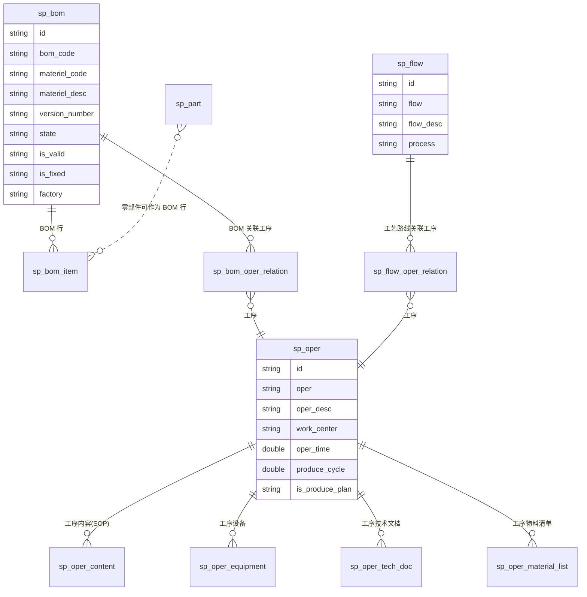
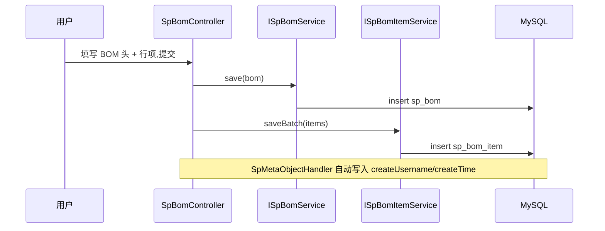
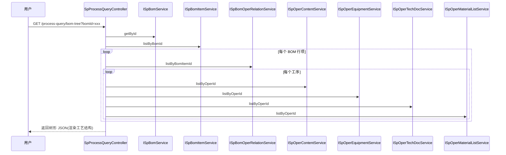

# 06 · 工艺管理 technology

> 位置:`com.wangziyang.mes.technology`
> 角色:**制造执行系统中最核心的数据结构**——工艺路线、BOM、零件、工序及工序扩展属性。该模块提供了离散制造行业最常用的"工艺路线 + BOM + 工序内容"模型。

## 6.1 目录结构

```text
com.wangziyang.mes.technology
├── controller/
│   ├── SpBomController.java                 // BOM 头表
│   ├── SpBomItemController.java             // BOM 行项
│   ├── SpBomOperRelationController.java     // BOM ↔ 工序
│   ├── SpFlowController.java                // 工艺路线头
│   ├── SpFlowOperRelationController.java    // 工艺路线 ↔ 工序
│   ├── SpOperController.java                // 工序
│   ├── SpOperContentController.java         // 工序内容(SOP)
│   ├── SpPartController.java                // 零部件
│   └── SpProcessQueryController.java        // 工艺综合查询
├── dto/
│   ├── SpBomDto.java
│   ├── SpFlowDto.java
│   └── SpFlowOperRelationDto.java
├── entity/
│   ├── SpBom.java
│   ├── SpBomItem.java
│   ├── SpBomOperRelation.java
│   ├── SpFlow.java
│   ├── SpFlowOperRelation.java
│   ├── SpOper.java
│   ├── SpOperContent.java
│   ├── SpOperEquipment.java
│   ├── SpOperMaterialList.java
│   ├── SpOperTechDoc.java
│   └── SpPart.java
├── mapper/                                  // MyBatis-Plus Mapper
├── request/                                 // XxxReq
├── service/                                 // IService + impl
└── vo/
    └── SpOperVo.java
```

## 6.2 数据模型



## 6.3 实体字段

### 6.3.1 [SpBom](file:///c:/Users/Zanna/.trae-cn/worktrees/MES-Springboot/feat-generate-code-wiki-6rEV1s/mes/src/main/java/com/wangziyang/mes/technology/entity/SpBom.java) — `sp_bom`

| 字段 | 含义 |
| ---- | ---- |
| `bomCode` | BOM 编号 |
| `materielCode` | 物料编码 |
| `materielDesc` | 物料描述 |
| `versionNumber` | 版本号 |
| `state` | `creat` / `pass` 审核状态 |
| `isValid` | 有效性(1 有效,0 无效) |
| `isFixed` | 定版标识(1 已定版,0 未定版) |
| `factory` | 工厂 |
| `deleted`(列名 `is_deleted`) | `00` 删除 / `01` 正常 / `02` 禁用 |

### 6.3.2 [SpBomItem](file:///c:/Users/Zanna/.trae-cn/worktrees/MES-Springboot/feat-generate-code-wiki-6rEV1s/mes/src/main/java/com/wangziyang/mes/technology/entity/SpBomItem.java) — `sp_bom_item`

BOM 行项,包含子件编码、数量、损耗率、关键件标识等(详见实体)。

### 6.3.3 [SpBomOperRelation](file:///c:/Users/Zanna/.trae-cn/worktrees/MES-Springboot/feat-generate-code-wiki-6rEV1s/mes/src/main/java/com/wangziyang/mes/technology/entity/SpBomOperRelation.java) — `sp_bom_oper_relation`

BOM 与工序的多对多关联(BOM 用到的工序)。

### 6.3.4 [SpFlow](file:///c:/Users/Zanna/.trae-cn/worktrees/MES-Springboot/feat-generate-code-wiki-6rEV1s/mes/src/main/java/com/wangziyang/mes/technology/entity/SpFlow.java) — `sp_flow`

| 字段 | 含义 |
| ---- | ---- |
| `flow` | 工艺路线编号 |
| `flowDesc` | 工艺路线描述 |
| `process` | 工艺时序描述,如 `A→B→C` |

### 6.3.5 [SpFlowOperRelation](file:///c:/Users/Zanna/.trae-cn/worktrees/MES-Springboot/feat-generate-code-wiki-6rEV1s/mes/src/main/java/com/wangziyang/mes/technology/entity/SpFlowOperRelation.java) — `sp_flow_oper_relation`

工艺路线与工序的关联,带顺序、关系类型(顺序/并行/选择)等。

### 6.3.6 [SpOper](file:///c:/Users/Zanna/.trae-cn/worktrees/MES-Springboot/feat-generate-code-wiki-6rEV1s/mes/src/main/java/com/wangziyang/mes/technology/entity/SpOper.java) — `sp_oper`

| 字段 | 含义 |
| ---- | ---- |
| `oper` | 工序编号 |
| `operDesc` | 工序名称 |
| `workCenter` | 加工单元编码 |
| `workCenterDesc` | 加工单元名称 |
| `operTime` | 工序工时(h) |
| `produceCycle` | 制造周期(h) |
| `isProducePlan` | 是否生成生产计划 |
| `isDeleted` | 1 删除 / 0 正常 / 2 禁用 |

### 6.3.7 工序扩展

- [SpOperContent](file:///c:/Users/Zanna/.trae-cn/worktrees/MES-Springboot/feat-generate-code-wiki-6rEV1s/mes/src/main/java/com/wangziyang/mes/technology/entity/SpOperContent.java) — `sp_oper_content`:**SOP**(标准作业指导),正文使用富文本(wangEditor)。
- [SpOperEquipment](file:///c:/Users/Zanna/.trae-cn/worktrees/MES-Springboot/feat-generate-code-wiki-6rEV1s/mes/src/main/java/com/wangziyang/mes/technology/entity/SpOperEquipment.java) — `sp_oper_equipment`:工序使用的设备。
- [SpOperMaterialList](file:///c:/Users/Zanna/.trae-cn/worktrees/MES-Springboot/feat-generate-code-wiki-6rEV1s/mes/src/main/java/com/wangziyang/mes/technology/entity/SpOperMaterialList.java) — `sp_oper_material_list`:工序物料清单。
- [SpOperTechDoc](file:///c:/Users/Zanna/.trae-cn/worktrees/MES-Springboot/feat-generate-code-wiki-6rEV1s/mes/src/main/java/com/wangziyang/mes/technology/entity/SpOperTechDoc.java) — `sp_oper_tech_doc`:工艺技术文档(蓝图、PDF、参数表)。

### 6.3.8 [SpPart](file:///c:/Users/Zanna/.trae-cn/worktrees/MES-Springboot/feat-generate-code-wiki-6rEV1s/mes/src/main/java/com/wangziyang/mes/technology/entity/SpPart.java) — `sp_part`

零部件主数据:`partNo` 编号 / `partName` 名称 / `remark` 备注 / `deleted` 状态。

## 6.4 关键 Controller

### 6.4.1 [SpBomController](file:///c:/Users/Zanna/.trae-cn/worktrees/MES-Springboot/feat-generate-code-wiki-6rEV1s/mes/src/main/java/com/wangziyang/mes/technology/controller/SpBomController.java)

| 接口 | 说明 |
| ---- | ---- |
| `GET /technology/bom/list-ui` | 列表页 |
| `GET /technology/bom/add-or-update-ui` | 新增/编辑页(同时加载 BOM Items) |
| `POST /technology/bom/page` | 分页(过滤 `is_deleted=0`、按 `materielCodeLike`) |
| `POST /technology/bom/save` | 新增(写 `sp_bom` + `sp_bom_item`) |
| `POST /technology/bom/update` | 更新 |
| `POST /technology/bom/delete` | 逻辑删除 |

### 6.4.2 [SpBomItemController](file:///c:/Users/Zanna/.trae-cn/worktrees/MES-Springboot/feat-generate-code-wiki-6rEV1s/mes/src/main/java/com/wangziyang/mes/technology/controller/SpBomItemController.java)

BOM 行项的增删改查,支持按 `bomId` 查询。

### 6.4.3 [SpBomOperRelationController](file:///c:/Users/Zanna/.trae-cn/worktrees/MES-Springboot/feat-generate-code-wiki-6rEV1s/mes/src/main/java/com/wangziyang/mes/technology/controller/SpBomOperRelationController.java)

BOM ↔ 工序的多对多维护,模板 `templates/technology/bomoperrelation/*`。

### 6.4.4 [SpFlowController](file:///c:/Users/Zanna/.trae-cn/worktrees/MES-Springboot/feat-generate-code-wiki-6rEV1s/mes/src/main/java/com/wangziyang/mes/technology/controller/SpFlowController.java)

工艺路线头(增删改查 + 分页)。

### 6.4.5 [SpFlowOperRelationController](file:///c:/Users/Zanna/.trae-cn/worktrees/MES-Springboot/feat-generate-code-wiki-6rEV1s/mes/src/main/java/com/wangziyang/mes/technology/controller/SpFlowOperRelationController.java)

工艺路线 ↔ 工序,模板 `templates/technology/flowprocess/*`。

### 6.4.6 [SpOperController](file:///c:/Users/Zanna/.trae-cn/worktrees/MES-Springboot/feat-generate-code-wiki-6rEV1s/mes/src/main/java/com/wangziyang/mes/technology/controller/SpOperController.java)

工序主数据。

### 6.4.7 [SpOperContentController](file:///c:/Users/Zanna/.trae-cn/worktrees/MES-Springboot/feat-generate-code-wiki-6rEV1s/mes/src/main/java/com/wangziyang/mes/technology/controller/SpOperContentController.java)

SOP 富文本编辑;模板 `templates/technology/opercontent/*`。

### 6.4.8 [SpPartController](file:///c:/Users/Zanna/.trae-cn/worktrees/MES-Springboot/feat-generate-code-wiki-6rEV1s/mes/src/main/java/com/wangziyang/mes/technology/controller/SpPartController.java)

零部件主数据,模板 `templates/technology/part/*`。

### 6.4.9 [SpProcessQueryController](file:///c:/Users/Zanna/.trae-cn/worktrees/MES-Springboot/feat-generate-code-wiki-6rEV1s/mes/src/main/java/com/wangziyang/mes/technology/controller/SpProcessQueryController.java)

工艺综合查询:通过 BOM ID 拉取 BOM Items → 关联工序 → 关联设备/物料/技术文档/SOP,模板 `templates/technology/processquery/*`,前端采用 treeTable 组件展示。

## 6.5 模板与前端

- `templates/technology/bom/list.ftl` + `addOrUpdate.ftl` — BOM
- `templates/technology/bomoperrelation/*` — BOM ↔ 工序
- `templates/technology/flowprocess/*` — 工艺路线 + 工序
- `templates/technology/oper/list.ftl` + `addOrUpdate.ftl` — 工序
- `templates/technology/opercontent/list.ftl` + `edit.ftl` — SOP
- `templates/technology/part/*` — 零部件
- `templates/technology/processquery/*` — 综合查询

## 6.6 DTO / VO

- [SpBomDto](file:///c:/Users/Zanna/.trae-cn/worktrees/MES-Springboot/feat-generate-code-wiki-6rEV1s/mes/src/main/java/com/wangziyang/mes/technology/dto/SpBomDto.java):BOM 头 + 行项的复合 DTO
- [SpFlowDto](file:///c:/Users/Zanna/.trae-cn/worktrees/MES-Springboot/feat-generate-code-wiki-6rEV1s/mes/src/main/java/com/wangziyang/mes/technology/dto/SpFlowDto.java):工艺路线 + 工序关联
- [SpFlowOperRelationDto](file:///c:/Users/Zanna/.trae-cn/worktrees/MES-Springboot/feat-generate-code-wiki-6rEV1s/mes/src/main/java/com/wangziyang/mes/technology/dto/SpFlowOperRelationDto.java)
- [SpOperVo](file:///c:/Users/Zanna/.trae-cn/worktrees/MES-Springboot/feat-generate-code-wiki-6rEV1s/mes/src/main/java/com/wangziyang/mes/technology/vo/SpOperVo.java)

## 6.7 业务流程示例:新建 BOM



## 6.8 业务流程示例:工艺综合查询



## 6.9 下一步

- 基础数据 / 订单 / 计划 / 数字化 → [07-business.md](07-business.md)
- 部署与运行 → [08-deployment.md](08-deployment.md)
