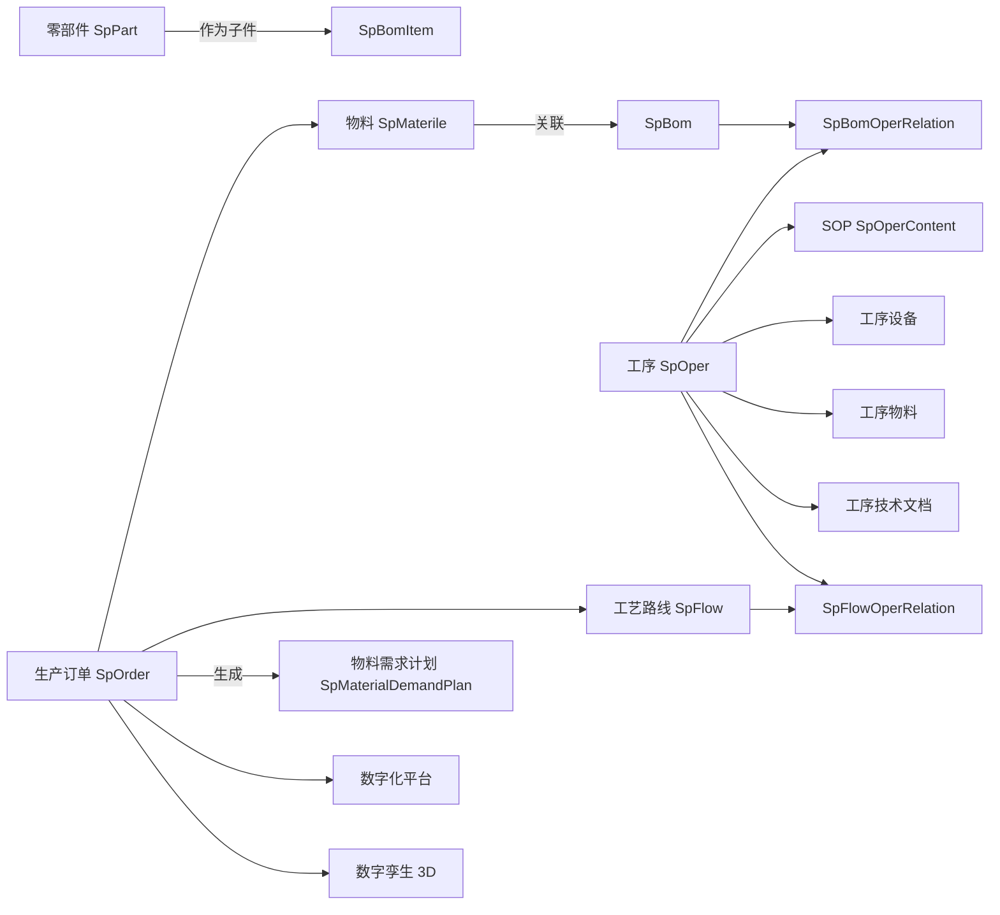

# 07 · 业务模块

> 涵盖 `basedata`(基础数据)、`order`(订单/工单)、`plan`(物料需求计划)、`digitization`(数字化平台)、`dst`(数字孪生 3D)。

## 7.1 基础数据 basedata

位置:`com.wangziyang.mes.basedata`

### 7.1.1 目录

```text
com.wangziyang.mes.basedata
├── common/                    // 通用基础数据(动态表 CRUD)
│   ├── controller/
│   │   ├── SpSysDictController.java
│   │   └── TableNameDataController.java
│   ├── dto/CommonDto.java、SpSysDictDto.java
│   ├── entity/SpSysDict.java
│   ├── mapper/QueryTableNameDataMapper.java、SpSysDictMapper.java
│   ├── request/QueryTableNameDataReq.java
│   └── service/...impl/...
├── controller/
│   ├── SpMaterileController.java         // 物料主数据
│   ├── SpTableManagerController.java     // 主数据平台-表头
│   └── SpTableManagerItemController.java // 主数据平台-字段
├── dto/SpTableManagerDto.java
├── entity/
│   ├── SpMaterile.java
│   ├── SpTableManager.java
│   └── SpTableManagerItem.java
├── mapper/...
├── request/SpTableManagerReq.java、spMaterileReq.java
└── service/...
```

### 7.1.2 物料主数据

[SpMaterileController](file:///c:/Users/Zanna/.trae-cn/worktrees/MES-Springboot/feat-generate-code-wiki-6rEV1s/mes/src/main/java/com/wangziyang/mes/basedata/controller/SpMaterileController.java):

- `GET /basedata/materile/list-ui` → `templates/basedata/materile/list.ftl`
- `GET /basedata/materile/add-or-update-ui` → `templates/basedata/materile/addOrUpdate.ftl`
- `POST /basedata/materile/page`
- `POST /basedata/materile/save` / `update` / `delete`
- 写时同时关联到 `ISpFlowService`(用于挂接工艺路线)

### 7.1.3 动态主数据平台

[SpTableManagerController](file:///c:/Users/Zanna/.trae-cn/worktrees/MES-Springboot/feat-generate-code-wiki-6rEV1s/mes/src/main/java/com/wangziyang/mes/basedata/controller/SpTableManagerController.java) + [SpTableManagerItemController](file:///c:/Users/Zanna/.trae-cn/worktrees/MES-Springboot/feat-generate-code-wiki-6rEV1s/mes/src/main/java/com/wangziyang/mes/basedata/controller/SpTableManagerItemController.java):

- `sp_table_manager`:主数据表头(物理表名、显示名)
- `sp_table_manager_item`:字段明细(字段名、是否列表显示、是否可编辑、字典引用等)

### 7.1.4 通用主数据 CRUD

[TableNameDataController](file:///c:/Users/Zanna/.trae-cn/worktrees/MES-Springboot/feat-generate-code-wiki-6rEV1s/mes/src/main/java/com/wangziyang/mes/basedata/common/controller/TableNameDataController.java):

通过 `QueryTableNameDataReq` 接收 `tableName`、`tableNameId`,反射拼接 SQL,**对任意一张配置好的表做分页/新增/修改/删除**。

- `POST /basedata/common/page` → 分页(返回 `List<Map<String, String>>`)
- `GET /basedata/common/add-or-update-ui` → 维护界面
- `POST /basedata/common/add-or-update` → 新增/更新
- `POST /basedata/common/delete` → 删除

实现见 [TableNameDataServiceImpl](file:///c:/Users/Zanna/.trae-cn/worktrees/MES-Springboot/feat-generate-code-wiki-6rEV1s/mes/src/main/java/com/wangziyang/mes/basedata/common/service/impl/TableNameDataServiceImpl.java) 与 [QueryTableNameDataMapper.xml](file:///c:/Users/Zanna/.trae-cn/worktrees/MES-Springboot/feat-generate-code-wiki-6rEV1s/mes/src/main/resources/mapper/basedata/common/QueryTableNameDataMapper.xml)。

### 7.1.5 通用字典

[SpSysDictController](file:///c:/Users/Zanna/.trae-cn/worktrees/MES-Springboot/feat-generate-code-wiki-6rEV1s/mes/src/main/java/com/wangziyang/mes/basedata/common/controller/SpSysDictController.java) + [SpSysDictServiceImpl](file:///c:/Users/Zanna/.trae-cn/worktrees/MES-Springboot/feat-generate-code-wiki-6rEV1s/mes/src/main/java/com/wangziyang/mes/basedata/common/service/impl/SpSysDictServiceImpl.java) + [SpSysDictMapper.xml](file:///c:/Users/Zanna/.trae-cn/worktrees/MES-Springboot/feat-generate-code-wiki-6rEV1s/mes/src/main/resources/mapper/basedata/common/SpSysDictMapper.xml):

- 提供按字典类型/字典编码查询的接口,被前端下拉框/单选/多选组件调用。
- 与 `system.entity.SysDict` 配合使用(系统字典 + 业务字典分离)。

## 7.2 订单(工单)order

位置:`com.wangziyang.mes.order`

```text
com.wangziyang.mes.order
├── controller/SpOrderController.java
├── entity/SpOrder.java
├── mapper/SpOrderMapper.java
├── request/SpOrderReq.java
└── service/{ISpOrderService, impl/SpOrderServiceImpl}
```

### 7.2.1 [SpOrder](file:///c:/Users/Zanna/.trae-cn/worktrees/MES-Springboot/feat-generate-code-wiki-6rEV1s/mes/src/main/java/com/wangziyang/mes/order/entity/SpOrder.java) — `sp_order`

- `orderCode`:生产订单号
- `materielCode` / `materielDesc`:物料编码 / 描述
- `orderQty`:数量
- `startDate` / `endDate`:计划开始 / 结束
- `state`:订单状态(草稿/下达/完工/关闭)
- `flowCode` / `flowDesc`:关联工艺路线
- 业务字段详见实体类

### 7.2.2 [SpOrderController](file:///c:/Users/Zanna/.trae-cn/worktrees/MES-Springboot/feat-generate-code-wiki-6rEV1s/mes/src/main/java/com/wangziyang/mes/order/controller/SpOrderController.java)

| 接口 | 说明 |
| ---- | ---- |
| `GET /order/release/list-ui` | 列表页 → `templates/order/production/list.ftl` |
| `GET /order/release/add-or-update-ui` | 编辑页 → `templates/order/production/addOrUpdate.ftl` |
| `POST /order/release/page` | 分页查询 |
| `POST /order/release/save`、`/update`、`/delete` | CRUD |

## 7.3 物料需求计划 plan

位置:`com.wangziyang.mes.plan`

```text
com.wangziyang.mes.plan
├── controller/SpMaterialDemandPlanController.java
├── entity/SpMaterialDemandPlan.java
├── mapper/SpMaterialDemandPlanMapper.java
├── request/SpMaterialDemandPlanReq.java
└── service/{ISpMaterialDemandPlanService, impl}
```

### 7.3.1 [SpMaterialDemandPlan](file:///c:/Users/Zanna/.trae-cn/worktrees/MES-Springboot/feat-generate-code-wiki-6rEV1s/mes/src/main/java/com/wangziyang/mes/plan/entity/SpMaterialDemandPlan.java) — `sp_material_demand_plan`

- `orderCode` / `productSerialNo` / `taskSerialNo`:订单/产品/任务序列号
- `materielCode` / `materielDesc`:物料编码/描述
- `demandQty` / `issuedQty`:需求/已发放数量
- `stockInStatus`:收料状态
- `planDate`:计划日期

### 7.3.2 [SpMaterialDemandPlanController](file:///c:/Users/Zanna/.trae-cn/worktrees/MES-Springboot/feat-generate-code-wiki-6rEV1s/mes/src/main/java/com/wangziyang/mes/plan/controller/SpMaterialDemandPlanController.java)

| 接口 | 说明 |
| ---- | ---- |
| `GET /plan/material-demand/list-ui` | 列表页 → `templates/plan/materialdemand/list.ftl` |
| `GET /plan/material-demand/add-or-update-ui` | 编辑页 |
| `POST /plan/material-demand/page` | 分页(支持订单号/产品/任务/收料状态过滤) |
| `POST /plan/material-demand/save`、`/update`、`/delete` | CRUD |
| `GET /plan/material-demand/export` | Excel 导出,使用 Hutool `ExcelWriter` 生成 `.xlsx` |

导出实现思路:

1. 查询全量数据(`List<Map<String, Object>>`)。
2. 用 `cn.hutool.poi.excel.ExcelUtil.getWriter()` 创建 `ExcelWriter`。
3. 写入表头与数据行。
4. `ByteArrayOutputStream` → `ResponseEntity<byte[]>`(文件名 `URLEncoder.encode`)。

## 7.4 数字化平台 digitization

位置:`com.wangziyang.mes.digitization`(仅一个 Controller,其余页面/数据加载由前端完成)

[PlanDataController](file:///c:/Users/Zanna/.trae-cn/worktrees/MES-Springboot/feat-generate-code-wiki-6rEV1s/mes/src/main/java/com/wangziyang/mes/digitization/controller/PlanDataController.java):

- `GET /digitization/plan/plan-ui` → `templates/digitization/planDemo.ftl`
- `GET /digitization/plan/plandg-ui` → `templates/digitization/plandg.ftl`

前端配套:

- `static/js/mes/digitization/orderMete.js`:工单指标(产量、达成率)
- `static/js/mes/digitization/area_echarts.js`:区域 ECharts
- `static/js/mes/digitization/plandg.js`:甘特图
- `static/js/mes/digitization/china.js` + `js.js`:中国地图
- 样式:`static/css/planDemo.css`

特点:**热部署 SQL 视图**——通过直接查询数据库视图刷新数据,无需重启服务。

## 7.5 数字孪生 dst

位置:`com.wangziyang.mes.dst`

[DigitalSimulationController](file:///c:/Users/Zanna/.trae-cn/worktrees/MES-Springboot/feat-generate-code-wiki-6rEV1s/mes/src/main/java/com/wangziyang/mes/dst/controller/DigitalSimulationController.java):

- `GET /digital/simulation/list-ui` → `templates/digitization/3DProject.ftl`

依赖前端资源:

- `static/lib/ThreeJs/three.js` 主体
- `static/lib/ThreeJs/OrbitControls.js`、`FirstPersonControls.js`、`TransformControls.js`、`DragControls.js`
- `static/lib/ThreeJs/OBJLoader.js`、`MTLLoader.js`
- `static/lib/ThreeJs/EffectComposer.js`、`OutlinePass.js`、`RenderPass.js`
- `static/lib/ThreeJs/ThreeJs_Composer.js`、`ThreeJs_Drag.js`、`Modules.js`、`config.js`
- 贴图:`static/lib/ThreeJs/images/skybox/*`、`floor.jpg`、`rack.png` 等
- 字体:`static/lib/ThreeJs/FZYaoTi_Regular.json`(3D 文字)

可实现 3D 仓库、3D 产线、3D 设备的高保真浏览、剖切、拖拽等交互。

## 7.6 业务流转关系图



## 7.7 下一步

- 部署与运行 → [08-deployment.md](08-deployment.md)
